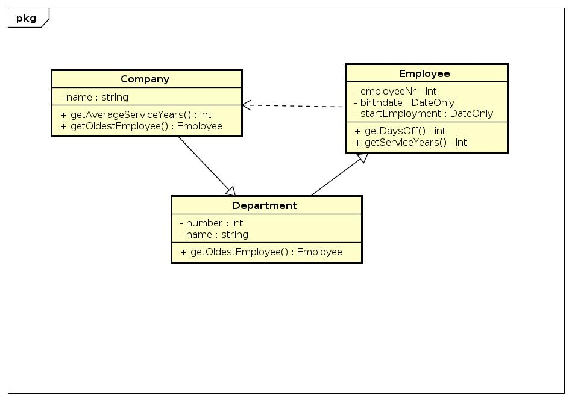

# Startdocument voor eind opdracht C# vakantiedagen

Startdocument van **Youri Tapper**. Student number **5076315**.

## Het probleem

Het aantal vakantiedagen van werknemers van een bedrijf wordt als volgt
berekend: werknemers van afdeling 1 hebben 24 basisvakantiedagen,
werknemers van andere afdelingen hebben 20 basisvakantiedagen. Daarbij
krijgen werknemers ouder dan 55 jaar 5 extra vakantiedagen en werknemers
die meer dan 10 jaar in dienst zijn 3 extra vakantiedagen.
Er dient een programma te worden ontwikkeld waarmee voor iedere werk-
nemer de geboortedatum en datum van indiensttreding (formaat ddmmjjjj) en
een vier-cijferig werknemersnummer kunnen worden ingevoerd. Het eerste
cijfer van het werknemersnummer komt overeen met de afdeling. Voor elke
werknemer moet het aantal vakantiedagen worden bepaald en getoond.
Verder moeten cumulatief het totale aantal vakantiedagen, het gemiddeld
aantal dienstjaren en de oudste werknemer worden getoond.

### Invoer & Uitvoer

In dit hoofdstuk staat de invoer en uitvoer bescheven.

#### Invoer

In de tabel hieronder staan alle invoeren beschreven.

| Situatie                | Type       | Voorwaarden                                |
| ----------------------- | ---------- | ------------------------------------------ |
| Naam werknemer          | `String`   | Niet leeg                                  |
| Geboorte datum          | `DateOnly` | Een geldige datum die in het verleden ligt |
| Datum in dienst treding | `DateOnly` | Datum > datum vandaag                      |
| Werknemer nummer        | `int`      | een getal van 4 lang                       |

#### Uitvoer

#### Berekeningen

| Situatie                                                      | Berekening |
| ------------------------------------------------------------- | ---------- |
| Bereken vakantie dagen                                        |            |
| Afdeling 1 jonger dan 55 jaar en minder dan 10 jaar in dienst | `24`       |
| Afdeling 1 ouder dan 55 jaar en minder dan 10 jaar in dienst  | `24+5`     |
| Afdeling 1 ouder dan 55 jaar en langer dan 10 jaar in dienst  | `24+5+3`   |

#### Opmerkingen

* Invoer wordt gevalideerd.

## Klassen Diagram

## Testplan

In dit hoofdstuk staan de tests bescheven die gaan worden uitgevoerd.

### Test data
In de onderstaande table vind je alle data die gebruikt gaat worden om te testen.

#### Employee

| employeeNr | birthdate  | startEmployment |
| ---------- | ---------- | --------------- |
| 1234       | 01-01-1991 | 05-06-2022      |
| 1999       | 04-02-1995 | 19-05-2022      |
| 3562       | 11-05-1999 | 11-01-2022      |
| 0958       | 18-08-1980 | 07-12-2021      |
| 3421       | 20-10-2000 | 11-11-2021      |

#### Department

| number | name       |
| ------ | ---------- |
| 0      | Afdeling 0 |
| 1      | Afdeling 1 |
| 2      | Afdeling 2 |
| 3      | Afdeling 3 |
| 4      | Afdeling 4 |

#### Company

| name   |
| ------ |
| TechIT |
| MyIT   |

### Test Situaties

In dit hoofstuk staan de testSituatie bescheven. Elke test begin met de test data als beginpunt.

#### #1 Het toevoegen van een werknemer

Voer de gegevens in om de pagina werknemer toevoegen:

employeeNr: 1234
birthDate: 01-01-1991
startEmployment: 05-06-2022 

Verwachte uitvoer:
De gebruiker is aangemaakt.

#### #2 De uitvoer van een bedrijf weergeven

Vul alle testdata in en ga dan naar overzicht pagina

Verwachte uitvoer:
oudste werknemer = 0958
totale vakantiedagen = 145
Gemiddelde aantal dienstjaren = 0

#### #3 De uitvoer van vakantie dagen voor 1 medewerker

Ga naar vakantie dagen en select daar mederwerker 1999

Verwachte uitvoer:
Mederwerker 1999 heeft 24 vakantie dagen
